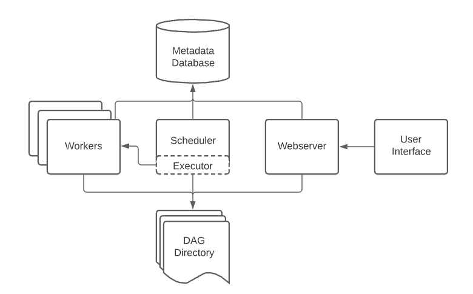
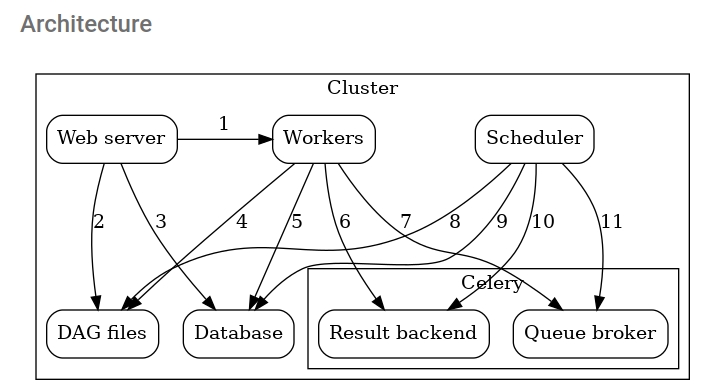
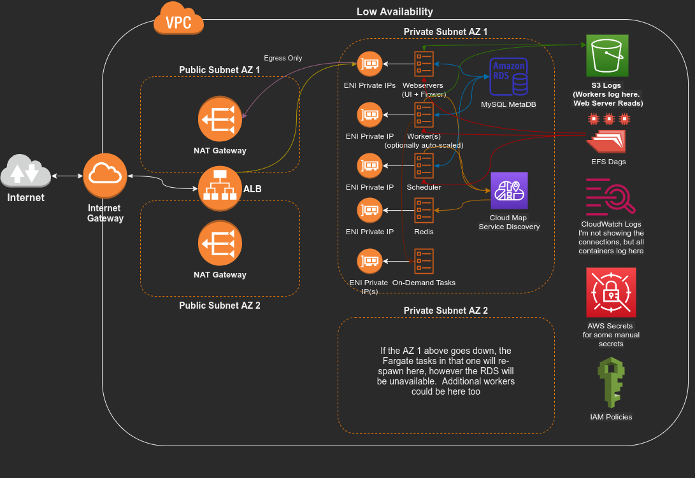
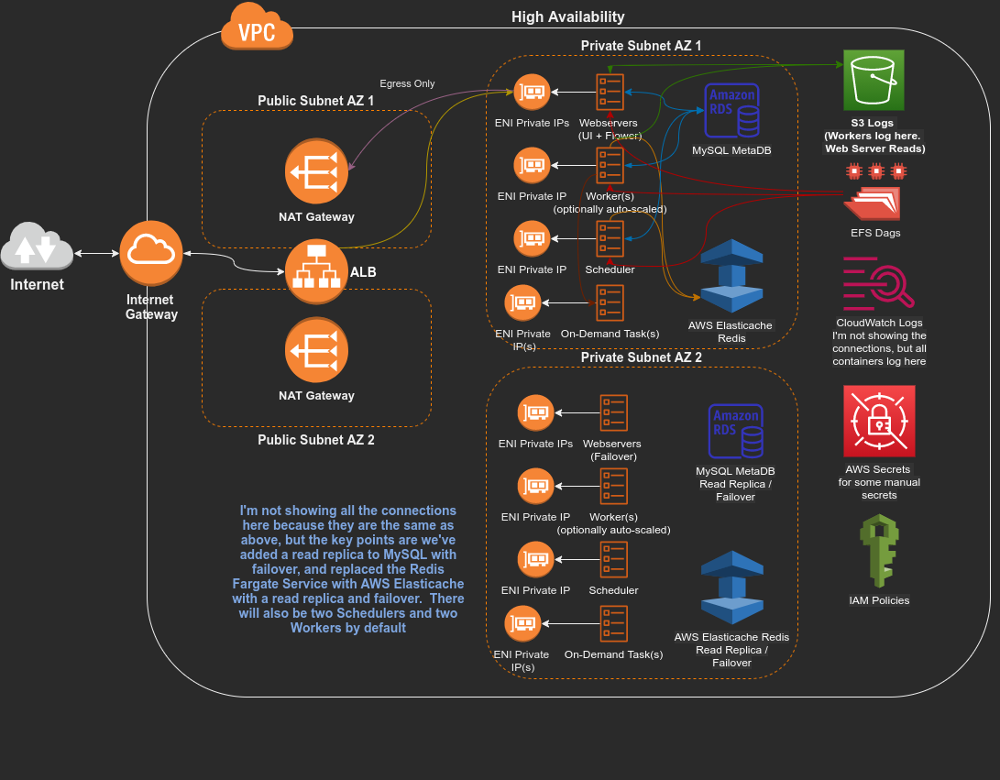

# Automated Airflow 2.0 Deployment on AWS with CDK and High Availability

Airflow 2.0 was a major milestone in the Airflow project, and brings with in a wide variety of improvements.  [Here is a playlist of some of the new goodies](https://www.youtube.com/playlist?list=PLCi-q9vYo4x-PESoBcXN0tXCMgzh5c_Pj).  One of the more notable is the advent of the highly available Scheduler component.   Another fairly new tool is the AWS CDK project, which allows us to use a variety of programming languages to create infrastructure as code projects.  Below I will outline several approaches to using these tools with a variety of AWS componenents to automatically create a highly available Airflow 2.0 architecture

## 📐
## Architecture

First let's consider the boilerplate well-architected configuration for a Fargate task


[Source](https://aws.amazon.com/blogs/compute/task-networking-in-aws-fargate/)

Because we want out service to (optionally thanks to the CDK) be highly available, we need to duplicate this (two public subnets and two private subnets), as well as implement fault tolerant services.  The CDK will do a lot of the heavy lifting for this on our behalf (e.g. creating the VPC, the subnets, the internet gateway, NAT gateways in the public subet, as well as easily allowing us to create fault tolerant services and put things in the right places)

Now let's look Airflow at a high level



[Details](https://airflow.apache.org/docs/apache-airflow/stable/concepts/overview.html#workloads)

Also, we will be using the Celery (distributed) executer, with Redis as our Queue Broker, so it looks a little more like this.



[Details](https://airflow.apache.org/docs/apache-airflow/stable/executor/celery.html)

## 🎯
## Solutions

So how do we stitch these together?


Key takeaways:

1. The Web Server, Workers, Scheduler all need access to a shared Database, as well as access to a synchronized file system housing the DAG definitions
   - The Web Server needs to read the DAGs and display them, as well as send information to the database when we manually trigger them (for the Scheduler to pick up and send to the Executer)
   - The Workers need the DAGs to get the actual code to execute
   - The Scheduler needs the DAGs to read the time schedules to figure out when it needs to send information to the Queue Broker
   - See the [details](https://airflow.apache.org/docs/apache-airflow/stable/executor/celery.html) on the interactions between these components
2. Web Server - There are actually two
   - [The Main UI](https://airflow.apache.org/docs/apache-airflow/stable/ui.html).  From here we can view our DAGs and monitor their execution, as well as view the logs, and trigger DAGs manually.  Because we are using Redis as our Queue Broker, we will also have
   - [The Flower UI](https://flower.readthedocs.io/en/latest/screenshots.html).  This will show lots of information about what jobs are being received from the Scheduler as well as which Workers they go to for execution
   - We will combine these two into a Fargate Service with one Fargate Task Definition, using two containers and an Application Load Balancer to direct the traffic properly
3. Workers - By default, we will have one dedicated Worker (or two if the high availability flag is set).  Also we can set an auto-scaling flag that will autoscale based on CPU and/or Memory consumption of the Workers.   This will be another Fargate Service with it's own Task Definition
4. Scheduler - By default, we will have one dedicated Scheduler (or two if the high availability flag is set).  This will be another Fargate Service with it's own Task Definition
5. Database - By default, we will have an AWS MySQL instance as our MetaDatabase.  If the high availability flag is set, we will also have a read-only replica in another Availability Zone with automatic failover configured.   The database will also be used as the Celery Result Backend [_make_sure_to_use_a_database_backend_](https://airflow.apache.org/docs/apache-airflow/stable/executor/celery.html)
6. DAG Files - We will use an AWS Elastic File System (EFS) and mount a volume / directory on there in the Web Server, Worker and Scheduler Fargate Tasks so that everything has a synchronized view of the DAGs.  We will also mount another directory on here for the external tasks
7. Queue Broker - By default, we will use the [Official Redis Docker](https://hub.docker.com/_/redis) image.  This will be another Fargate Service and Task Definition.  If the high availability flag is set, we will instead use the AWS Elasticache Service, with a read-only replica in another Availability Zone with automatic failover configured

What does this look like?

If we configure for low availability (cheaper, but _NOT_ fault tolerant if the AZ with the database goes down)



If we configure for high availability



## 🎤
## Shout Outs

Before we begin, I need to give shout outs to the giants on whose shoulders this project stands:

- [Alvarez Palmer](https://aws.amazon.com/blogs/containers/running-airflow-on-aws-fargate/) - This tutorial was the foundation of this project, and took it about 50% of where it needed to be.  It's in TypeScript and using Airflow 1.0, but was very useful.  It's interesting to note that AWS SQS will work with celery, as he demonstrates, however the Flower UI is not compatible with SQS, so I've opted for Redis.  Also, the idea of "on-demand" tasks comes from here
- [Axel Furlan](https://towardsdatascience.com/how-to-deploy-apache-airflow-with-celery-on-aws-ce2518dbf631) - This does a great job of explaining how all the different Airflow components need to interact.  It's also Airflow 1.0, but a good read.  This led me to Cloud Map, Service Discovery and Private Namespaces.  Now we're at 60%
- [Mystique](https://github.com/miztiik/fargate-with-efs/blob/master/README.md) -  This is a great deep dive into using EFS with Fargate.  It was also the inspiration for me to upskill my Markdown game, which is why this README is `READABLE`.  Now we're at 70%
- Everything else is due to CDK and furious googling

## 📖
## Prerequistes

- 🛠 If you are not familiar with CDK, [Here's how to get set up](https://cdkworkshop.com/15-prerequisites.html).  E.g. this will describe how to get the latest AWS CLI, set up an admin AWS account, install a compatible nodejs and Python, and of course the CDK toolkit itself (this should take 15 minutes or less).   I would also highly recommend going through the [The Workshop Project](https://cdkworkshop.com/30-python.html) so the code will make more sense

- 🛠 Since we will be building docker images, you should have an up to date Docker installation, and be able to run Docker without sudo.   [Here are the Docker post-install instructions to run Docker without sudo](https://docs.docker.com/engine/install/linux-postinstall/).  You may need to reboot to get it to kick in

## ⚙️
## Setting up the environment

At this point, you should have all the tools installed, as well as admin aws credentials in your ~/.aws/credentials file.  If you have multiple profiles, you can append `--profile yourprofile` to the cdk commands, _without this flag the default profile will be used_.  Make sure you have the `"region ="` line configured in your credentials as well.  I am using `us-east-1`.  You may run into [EIP Limits](https://docs.aws.amazon.com/AWSEC2/latest/UserGuide/elastic-ip-addresses-eip.html#using-instance-addressing-limit) or [VPC Limits](https://docs.aws.amazon.com/vpc/latest/userguide/amazon-vpc-limits.html#vpc-limits-vpcs-subnets) if you already have stuff in the region you choose, so it might make sense to test in an empty region.  Also be aware of [which services are available in a given region](https://aws.amazon.com/about-aws/global-infrastructure/regional-product-services/)

_Change the commands to suit your OS, the following is written for `Ubuntu`_

- Get the application code

    ```bash
    git clone https://github.com/bshinnebarger/fairflow-cdk.git
    cd fairflow-cdk
    ```

- If you don't already have the cdk installed or pip and virtualenv installed you will need those

    ```bash
    # If you don't have cdk installed
    npm install -g aws-cdk

    # Python 3 pip / virtualenv
    sudo apt install python3-pip
    pip3 install virtualenv
    ```

- Create a pip virtual environment (in the fairflow-cdk directory) and install the dependencies.  See `install_requires=` in [setup.py](setup.py)

    ```bash
    python3 -m venv .venv
    source .venv/bin/activate
    pip install -r requirements.txt # once you're in the venv it's ok to use pip instead of pip3
    ```

- `The first (and only) time you deploy` an AWS CDK app into an AWS envrionment _(account/region)_, you need to `bootstrap the CDK`.  This creates an S3 bucket where CDK will store some meta data.  This will use the default aws profile.  You can `append --profile` to override this, or you can [get more advanced](https://docs.aws.amazon.com/cdk/latest/guide/environments.html)

    ```bash
    cdk bootstrap # --profile yourprofile
    cdk ls # show stacks in our app
    ```

- Other useful CDK commands we will use (you may want to wait until you've read the configuration options below before deploying)

    ```bash
    cdk synth # shows the cloudformation (CFN) yml our app generates
    cdk deploy # deploys the app (creates CFN stack or modifies existing one)
    cdk diff # shows what will change in our stack (run before you deploy for info)
    ```

You should see an output of the available stack:

```bash
FairflowStack
```

## 🤐
## Manual AWS Secrets

There are some environment variables we need to store in AWS secrets before beginning.  _If you deploy to multiple regions you should make these in all the regions_.  See [the docs](https://docs.aws.amazon.com/cdk/api/latest/docs/aws-secretsmanager-readme.html) about why we shouldn't create the secrets in the CDK app itself, or [this discussion](https://github.com/aws/aws-cdk/issues/5810#issuecomment-672736662)

_Make note of the ARNs of the secrets you create (or you can get them later from the Secrets Console **THE airflow PREFIX IS IMPORTANT**, it will be used by our IAM policies_

First, we need a [Fernet Key](https://airflow.apache.org/docs/apache-airflow/stable/security/secrets/fernet.html).  In your virtual envrionment you can run the following to get one:

```bash
python helpers/generate_fernet.py
```

Take the key that was generated and create your secret
```bash
aws secretsmanager create-secret --name airflow-fernet-key --secret-string "your_fernet_key"
```
Next create a secret for the admin user password for the main web UI
```bash
aws secretsmanager create-secret --name airflow-admin-password --secret-string "your_ui_password"
```
We also need [Flower Credentials](https://airflow.apache.org/docs/apache-airflow/1.10.12/security.html#flower-authentication) for that UI.  These should take the form **user:password**, e.g. admin:supersecret
```bash
aws secretsmanager create-secret --name airflow-flower-credentials --secret-string "your_flower_ui_password"
```

There is one is optional.  In the examples below, we will be cloning / pulling the DAGs from another repository into our EFS.  I'm using a public repository, so you don't need to do this, but if you decide to replace the repo with your own and it's a private repository, one approach is create a read only [Deploy Key](https://docs.github.com/en/developers/overview/managing-deploy-keys).  Deploy keys are specific to a single repository.  Once you've made your key-pair and uploaded your public key to the repo through github, you can make a secret of the private one like this:
```bash
pk=$(cat ~/.ssh/mynewkey) # the private one
aws secretsmanager create-secret --name airflow-dag-repo-ro-privatekey --secret-string "$pk"
```
`If you deploy to multiple regions`, you'll need to copy the secret to the other regions.  If you click on the secret `airflow-dag-repo-ro-privatekey`, there is a button in the top right, `Replicate secret to other regions` that makes it simple

## 🔤
## Environment Variables

Once you've created your secrets, you can open an [env file](envs/us-east-1.env)

Fill in the ARNs of the secrets you've made.  There is also an `IP_WHITELIST` variable.  If you fill this in (comma separated list), the Application load balancer will additionally use IP restricted access.  Your file should look something like

```bash
AIRFLOW_FERNET_KEY_SECRET_ARN=arn:aws:secretsmanager:us-east-1:xxxxxxx:secret:airflow-fernet-key-75whQU
AIRFLOW_ADMIN_PASSWORD_SECRET_ARN=arn:aws:secretsmanager:us-east-1:xxxxxxx:secret:airflow-admin-password-aQg8w8
AIRFLOW_FLOWER_CREDENTIALS_SECRET_ARN=arn:aws:secretsmanager:us-east-1:xxxxxxx:secret:airflow-flower-credentials-qRI8im
GIT_READ_ONLY_SECRET_ARN= # Empty Because The Repo Is Public
DAG_REPOSITORY=https://github.com/bshinnebarger/airflow-example-dags.git
IP_WHITELIST=86.158.93.148 # If you want IP based restriction on the ALB
```

With that done, from within your virtual environment, you can load your variables `(Ubuntu)` with:

```bash
export $(xargs < ./envs/us-east-1.env)
env | grep -E "^(AIRFLOW|DAG|IP)" # verify they are there
```

You can change these at a later time and re-deploy the differences using CDK

## 🥞
## Fairflow Stack

[Code](fairflow/fairflow_stack.py)

What we are creating:

- First we are going to instruct the CDK to tag all resources we create, using the stack name (`construct_id`) passed in via the [app](app.py).  This will be super userful when using the Billing console to see all the resources and costs associated with the architecture deployment
    ```python
    cdk.Tags.of(scope).add('Stack', construct_id)
    ```
- A new [VPC](https://docs.aws.amazon.com/cdk/api/latest/docs/aws-ec2-readme.html).  By default, this will create public and private subnets in `max_azs` Availability Zones, using the account / region determined from the credentials profile you are using
- An [ECS Cluster](https://docs.aws.amazon.com/cdk/api/latest/docs/@aws-cdk_aws-ecs.Cluster.html) inside our new VPC.  Our Fargate Services will live in here
- A [Security Group](https://docs.aws.amazon.com/cdk/api/latest/docs/@aws-cdk_aws-ec2.SecurityGroup.html).  This will be shared by our:
    - Bastion Linux Host
    - MySQL Airflow Meta Database
    - Redis Fargate Service (or AWS Redis Elasticache in high availability mode)
    - Webserver, Scheduler and Worker Fargate Services
- An (optional) [Bastion Host](https://docs.aws.amazon.com/cdk/api/latest/docs/@aws-cdk_aws-ec2.BastionHostLinux.html).  By default this has no SSH access.  You connect via the Systems Manager console -> Session Manager, or via ssm-session, as detailed in [Testing the Solution](#testing-the-solution)
- Fairflow Construct - The meat of the application (see more below)

<br>

By default, the Fairflow Construct is configured as `highly_available = False` and `enable_autoscaling = False`.  This will deploy the "Low Availability" version (cheaper) as detailed in the [Solutions](#solutions) diagram above

## 🧩
## Fairflow Construct

[Code](fairflow/constructs/fairflow_construct.py)

This is the 🥩 and 🥔🥔 of the app, and orchestrates the creation of everything else we need for Airflow
<br>
What we are creating:

- [S3 Bucket](https://docs.aws.amazon.com/cdk/api/latest/docs/aws-s3-readme.html) for Worker Logs.  We are using S3 as the logging mechanism for Workers, as [recommended here](https://airflow.apache.org/docs/apache-airflow/stable/production-deployment.html#logging)
- [EFS Construct](#efs-construct)
- [RDS Construct](#rds-construct)
- [Secrets Construct](#secrets-construct)
- CloudWatch logging - This defines a log driver used by our Airflow Fargate services (separate from the s3 logging for the Workers).  I.e. the container in the Worker Fargate Task will log to CloudWatch, but the logs of the _actual work_ will be in s3
- [Redis Construct](#redis-construct)
- Airflow environment variables - See inline comments.  Airflow has many [default configs](https://airflow.apache.org/docs/apache-airflow/stable/configurations-ref.html).  The recommended approach is to override the ones relevant to your deployment with environment variables
- [Policies Construct](#policies-construct)
- [Docker Builds](#docker-builds)
- [External Tasks](#external-tasks)
- [Webserver Construct](#webserver-construct)
- [Scheduler Construct](#scheduler-construct)
- [Worker Construct](#worker-construct)

## 🗄️
## EFS Construct

[Code](fairflow/constructs/efs_construct.py)

This is where we create the shared file system using AWS EFS.  By default, when you create an EFS file system, there is only the root `/` directory, and it is owned by the root user (uid = 0, gid = 0).  However, in Airflow 2.0, the default user is airflow:root (uid = 50000, gid = 0), so if you try to mount it, you won't be able to.  To get around this we can use Access Points.   You can [read more about this here](https://docs.aws.amazon.com/efs/latest/ug/accessing-fs-nfs-permissions.html#accessing-fs-nfs-permissions-uid-gid).  To further complicate things, we will also be running on-demand [External Tasks](#external-tasks), and those tasks will be invoked by Airflow but run indepently of it, using entirely de-coupled Containers defined with their own Docker images, and those _WILL_ run as root.  In short, we will create two Access Points, one for our Airflow Workers and another for the on-demand Fargate Tasks
<br><br>
What we are creating:

  - The [EFS](https://docs.aws.amazon.com/cdk/api/latest/docs/aws-efs-readme.html).  You may also notice we do this
    ```python
    shared_fs.connections.allow_default_port_from(
        other = vpc_props.default_vpc_security_group,
        description = 'EFS Ingress'
    )
    ```
    CDK uses the [connections](https://docs.aws.amazon.com/cdk/api/latest/docs/@aws-cdk_aws-ec2.Connections.html) abstraction for managing things related to security groups.  This code says allow things in our shared security group to access the `EFS default port (2049)`.  This ensures the containers in our Fargate Tasks will be able to mount the EFS
  -  Access Points - Essentially these are directories within our EFS, with special features attached.  From the CDK docs -> _"If the root directory specified by path does not exist, EFS creates the root directory and applies the permissions specified here. If the specified path does not exist, you must specify create_acl"_.  So when we mount the `access_point`, the `create_acl` section says "if this path (/fairflow) doesn't exist (which it won't upon first mount), create it with owner 50000:root, and give the owner read/write access".   What the `posix_user` section says is "regardless of the uid/gid of the user who mounts via this access point, use this owner/group for all files and directories created".   What the `path` says is mount this path (/fairflow) as the root path.   E.g. in the `mounting_point` section, we specify the `container_path` as /shared-dags.  This means we mount /fairflow in the EFS to /shared-dags in the container
  -  Volumes - An ECS Construct where you can define a volume that will be attached to a Fargate Task using EFS with an Access Point
  -  Mounting Points - Another ECS Construct.  These will be attached to the actual container(s) within a Fargate Task

## 💾
## RDS Construct

[Code](fairflow/constructs/rds_construct.py)

This is where we create our MySQL Database.  Notice that we are using MySQL 8, which is very important, and related to the Airflow 2.0 Scheduler being highly availble, which in turn relies on some features only available in MySQL 8+.  [See More Here](https://airflow.apache.org/docs/apache-airflow/stable/concepts/scheduler.html#database-requirements)
<br><br>
What we are creating:

  - DB [Secret](https://docs.aws.amazon.com/cdk/api/latest/docs/aws-secretsmanager-readme.html) - It's OK to create this secret in the CDK, because it's randomly generated.  We pass this to the Database Instance and it will create the secret for us (with not only the user / pass, but the normal things like dbname, port, host etc...)
  - [RDS](https://docs.aws.amazon.com/cdk/api/latest/docs/aws-rds-readme.html) MySQL Instance - We create this in our new VPC, using our shared security group as well as specifying it should be created in our private subnets (not publicly accessible).  Also, notice the configuration `multi_az = highly_available`.  If using the highly available flag, this will automatically create a read-only replica in a second availability zone with automatic failover.  Other configurations can be found in the [config](fairflow/config.py) under `DEFAULT_DB_CONFIG`, but to summarize we are essentially using the minimum specs, since this is a meta database that doesn't need to be higly performant
  - As we did in the EFS construct, we are also here `exposing the default port (3306 for MySQL)` to our shared security group

## 🤫
## Secrets Construct

[Code](fairflow/constructs/secrets_construct.py)

We are simply obtaining the secrets we created [manually](#manual-aws-secrets) above using some [helper functions](https://docs.aws.amazon.com/cdk/api/latest/docs/aws-secretsmanager-readme.html#importing-secrets) provided by the CDK Secret Construct.  We will pass these as secret environment variables to the containers in the Fargate Tasks.  The [default entrypoint](airflow/config/default_entrypoint.sh) will use the credentials to configure access

## 📨
## Redis Construct

[Code](fairflow/constructs/redis_construct.py)

The Redis construct has two setups, one for high availability, and one without:

  - In the former, we create a Fargate Service using the [official Docker image](https://hub.docker.com/_/redis).
    ```python
    image = ecs.ContainerImage.from_registry(name = 'redis:6.2.5'),
    ```
    You can see various ways of [building Docker images via CDK here](https://docs.aws.amazon.com/cdk/api/latest/docs/aws-ecs-readme.html#images).  Using the `REDIS_CONFIG's` in [config](fairflow/config.py), we define a Task, a container, assign the shared security group, attach the CloudWatch logging driver defined in the [Fairflow Construct](#fairflow-construct), map ports as well as `allow ingress to the default Redis port (6379) to our security group`.  Another interesting aspect which only exists in the Redis Construct, is that we use a helper function `enable_cloud_map` and define a [Private Namespace](https://docs.aws.amazon.com/cdk/api/latest/docs/aws-servicediscovery-readme.html#private-dns-namespace-example) within there.  Fargate uses the [awsvpc network mode](https://docs.aws.amazon.com/AmazonECS/latest/developerguide/task-networking.html).  Each Fargate task is assigned an [ENI](https://docs.aws.amazon.com/AWSEC2/latest/UserGuide/using-eni.html), using a random private ip address within the range of ip's of the subnet it is created in.   Cloud Map allows us to create a private namespace, and then attach services to that namespace.   Here we call the namespace `fairflow`, and the service `redis`.  If from another Task within another Service (e.g. the Worker and Scheduler services) we use the DNS `redis.airflow`, it will resolve to the private IP address at runtime, allowing us to communicate with the Redis service

  - In the latter (high availability), we instead use AWS       Elasticache Redis.  `The Celery executer does not support Redis in "cluster mode"`, so we need to be careful.  The `cache_parameter_group_name` controls this.  `Under "cluster mode disabled", we also have to set num_node_groups to 1`.  You can see more about the parmeters in the [CFN Docs](https://docs.aws.amazon.com/AWSCloudFormation/latest/UserGuide/aws-resource-elasticache-replicationgroup.html).  You can see more about [cluster modes here](https://docs.aws.amazon.com/AmazonElastiCache/latest/red-ug/CacheNodes.NodeGroups.html).  You might notice that our CDK constructs here all start with Cfn.  At the moment, the CDK Elasticache module has no L2 (opinionated) constructs, so we are dropping down to the lowest layer (just above regular CloudFormation).   See [more about constructs here](https://docs.aws.amazon.com/cdk/latest/guide/constructs.html#constructs_l1_using).  Essentially what we are creating is a very small Redis deployment in our shared security group, with a read-replica in another AZ with automatic failover enabled

## 🔐
## Policies Construct

[Code](fairflow/constructs/policies.py)

In the polices construct I attempt to follow the [least privledge model](https://docs.aws.amazon.com/IAM/latest/UserGuide/best-practices.html#grant-least-privilege)

- EFS - Allow read/write and mounting to access points in the EFS we create
- S3 - Allow full access, but only to our logs bucket
- Secrets - Allow read access to the automatically created RDS secret, `as well as secrets in the deployment account/region with the airflow prefix`
- ECS - Allow access to the external tasks we create and to run them _only inside the cluster we create_
- CloudWatch - read-only access to CloudWatch logs (only necessary for the External Task Containers)

## 👷
## Docker Builds

Before going on to the Airflow services and [External Tasks](#external-tasks), let's review the Docker builds.  When you see something like...
```python
image = ecs.ContainerImage.from_docker_image_asset(props.airflow_image)
```
in any of the Service definitions, the CDK will be creating a docker image from an asset directory (local), uploading it the ECR (which is why we need Docker without sudo), and assigning IAM policies to the Task Execution Role to pull from the ECR.  We will build three Docker images:

- The Airflow Services use an image built off the `local airflow` directory.  This is based off the `2.1.2-python3.8` [Docker Image](https://airflow.apache.org/docs/docker-stack/index.html).  You can see the [default extras included here](https://github.com/apache/airflow/blob/2c6c7fdb2308de98e142618836bdf414df9768c8/Dockerfile#L37).  Some of the advantages of [building or extending](https://airflow.apache.org/docs/docker-stack/build.html#build-build-image) are mentioned here.  In this tutorial we are extending the image.  To start, we add a few ubuntu packages like jq and git and the aws cli.  In a lot of Airflow tutorials, people have a DAGs folder in here and copy it to the image, so that DAGs are sync'd.  However, this seems a bit too trivial and if you plan to use anything beyond the stock Operators, you'll probably be installing external dependencies and/or using your own private git repo.  In this tutorial, I'll show two approaches

    1. In the Dockerfile, we install extra libraries in the [extras_requirements.txt](airflow/extra_requirements.txt) using the [constraints file](https://airflow.apache.org/docs/apache-airflow/stable/installation.html#constraints-files).  Our actual DAGs exist in [This Example Repo](https://github.com/bshinnebarger/airflow-example-dags), which is sync'd (cloned or pulled) into the EFS volume that the Airflow Services mount using [sync_repo.sh](airflow/config/sync_repo.sh).  The `AIRFLOW__CORE_DAGS_FOLDER` is added by airflow to the Python Path, so you can clone an entire repo there, and if there are DAGs in there, it will find them.  One of the DAGs in the example repo uses the Bash Operator to re-sync the repo, so you can do that via the Airflow UI, or even the new stable Rest API available in Airflow 2.0 (see examples in [Testing the Solution](#testing-the-solution)).   The advantage of this is that we can interate quickly on an evolving codebase, but the disadvantage is that our dependencies are now coupled to the airflow constraints, and whenever we change them, or require new ones, we have to test with that in mind and also rebuild the Docker image and update the stack
    1. In the `tasks` folder, we have two additonal Docker images.  These are just [Python 3.8 slim](https://hub.docker.com/_/python) images, _but they could be anything_.  This opens up the possibility of completely de-coupling your code from Airflow.  In the [External Tasks](#external-tasks), we will define Fargate Tasks, which can be configured however you want, with whatever Docker images you want, and in the example DAGs, we will show how to use the [ECS Operator](https://airflow.apache.org/docs/apache-airflow-providers-amazon/stable/operators/ecs.html).  To launch these "on-demand".   Using this approach, we can create an essentially [infinitely scalable](https://docs.aws.amazon.com/AmazonECS/latest/developerguide/service-quotas.html) workhorse that scales up and down with ease.  If taking this approach, it would probably make send to scale down the resources on the Worker service(s), since the majority of the work will be done in the external Tasks

<br>

The [entrypoint](airflow/config/default_entrypoint) is mostly derived from [the airflow official one](https://github.com/apache/airflow/blob/v2-1-stable/scripts/in_container/prod/entrypoint_prod.sh).  There are some additions / re-configurations at the end, mainly related to how we init the database and the UI admin (only on webserver launch) , sync'ing the repo (with optional ssh configuration)

## ⛱️
## External Tasks

[Code](fairflow/constructs/dag_tasks.py)

See [Docker Builds](#docker-builds) for more info on the Docker aspects
<br>
What we are creating:

- A new CloudWatch log driver with it's own log group for these external containers
- A "big task" with a little bit more resources, which mounts EFS as described in the [EFS Construct](#efs-construct), and built off this [Dockerfile](tasks/big_task/Dockerfile)
- A "little task" with fewer resources, which mounts EFS, and built off this [Dockerfile](tasks/little_task/Dockerfile)

In the [Fairflow Construct](#fairflow-construct) where we define envrionment variables, you may notice the `CLUSTER`, `SECURITY_GROUP`, and `SUBNETS` lines.  These are used by the ECS Operator to say where to launch a task.  A nice touch of the ECS Operator is that it will splice in the CloudWatch logs for what happens in the container into the S3 logs, so even though all the work is external to Airflow, we have complete logs in one place.  You can [see how here](https://github.com/apache/airflow/blob/8505d2f0a4524313e3eff7a4f16b9a9439c7a79f/airflow/providers/amazon/aws/operators/ecs.py#L304)

## 🕸️
## Webserver Construct

[Code](fairflow/constructs/webserver_construct.py)

See [Docker Builds](#docker-builds) for more info on the Docker aspects
<br>
What we are creating:

- Webserver Fargate Task - Defined using the `WEBSERVER_TASK_CONFIG` in the [configs](fairflow/config.py).  Attaches our EFS volume
- Adding the UI/Flower UI containers using the `WEBSERVER_CONFIG` and `FLOWER_CONFIG` in the configs.  This sets up the docker images, container logging, envrionment variables, entry points / commands and port mappings
- Webserver Fargate Service - Uses the Task Definition and launches the service into our shared security group
- Application Load Balancer - Here we create listeners on port 80 (redirecting to 8080 in the default task container), as well as port 5555 for the Flower UI.  This is public facing, and redirects to our private subnets.  Optionally, if the `IP_WHITELIST` [Environment Varialbe](#environment-variables) is set, it will add IP based restriction on the load balancer

## ⌚
## Scheduler Construct

[Code](fairflow/constructs/scheduler_construct.py)

See [Docker Builds](#docker-builds) for more info on the Docker aspects
<br>
What we are creating:

- Scheduler Fargate Task - Defined using the `SCHEDULER_TASK_CONFIG` in the [configs](fairflow/config.py).  Attaches our EFS volume
- Adding the container using the `SCHEDULER_CONFIG` in the config.  This sets up the docker image, container logging, envrionment variables, entry points / commands and port mappings
- Scheduler Fargate Service - Uses the Task definition and launches the service into our shared security group.  If the `highly_available` flag is set, we will launch two Schedulers, one in each AZ

## 💪
## Worker Construct

[Code](fairflow/constructs/worker_construct.py)

See [Docker Builds](#docker-builds) for more info on the Docker aspects
<br>
What we are creating:

- Worker Fargate Task - Defined using the `WORKER_TASK_CONFIG` in the [configs](fairflow/config.py).  Attaches our EFS volume
- Adding the container using the `WORKER_CONFIG` in the config.  This sets up the docker image, container logging, envrionment variables, entry points / commands and port mappings
- Worker Fargate Service - Uses the Task definition and launches the service into our shared security group.  If the `highly_available` flag is set, we will launch two dedicated worker, one in each AZ
- Optional Autoscaling - If the `enable_autoscaling` flag is set, the `WORKER_AUTOSCALING_CONFIG` will be used to enable cpu and/or memory based autoscaling

## 🚀
## Deploying the Application

In [fairflow_stack.py](fairflow/fairflow_stack.py) decide if you want to set `highly_available` and `enabled_autoscaling`.  Setting highly available to `False` will deploy faster.  Also, you can change these later, then run `cdk diff` to see the changes and `cdk deploy` to deploy them.  This is also useful if you decide to turn off the stock Airflow examples via the envrionment variable `AIRFLOW__CORE__LOAD_EXAMPLES`, or change the concurrency related vars or if you decide to alter the Task resources or whatever else you want to change

- **Stack: FairflowStack**

    Initiate the deployment with the following command,

    ```bash
    cdk deploy
    # or cdk deploy FairflowStack
    ```

    Sit 🪑 back, relax (it'll be about 10-15 minutes depending on the configs)!

## 🔬
## Testing the Solution

Let's check some things:

- Webserver - Check the `Outputs` section of the stack to access the `FairflowAlbDnsName`. This will also be in the EC2 console under load balancers.  Try to open this url in the browser, you should be able to see the Airflow UI.  The ALB should set up quickly, but you may get a 503 error for a brief time.  If you go to `dns:5555` you will get to the Flower UI.  Use the credentials you set up in [Manual AWS Secrets](#manual-aws-secrets) to log in

- If you scroll around the UI, look for the DAGs owners, `Brett` is the owner by default for the exampmle DAGs.  Click on that to filter.  There is a little slider to the left, you turn the DAG on by clicking that.  Keep an 👁️ on the Flower UI while you're running things to see the Redis queues in action.  The examples:

    - [airflow-example-dags Repo](https://github.com/bshinnebarger/airflow-example-dags)

    - MeaningOfLifeDag - slide this to on, then click on it.  Click the play button to launch it.  This one will run on the dedicated worker.  When `runs_on_worker` is green, click on it, then click `Log`.  This will display the logs stored in S3 to you for the run, **you'll also discover the meaning of life**

    - SynchronizeRepository - ditto from above.  If you click on the `Code` icon, you'll see that we are running a `BashOperator`, and invoking [sync_repo.sh](airflow/config/sync_repo.sh), that the [Dockerfile](airflow/Dockerfile) copied into our image

    - ECSExternalTasks - ditto from above.  Look through the code and you'll see we're pulling in environment variables that have the cluster and network config's, overridding container commands to do what we want, telling it where to store the container logs and using the Task `family` as the `task_definition`, which uses the latest version of a Task Definition.  This stuff is set up in the [External Taks](#external-tasks).  The ECS Operator will invoke these tasks, wait for them to complete or fail, do whatever it needs to do, then splice the container logs into the s3 logs

    - Other DAGs - all the other DAGs come from us setting the `AIRFLOW__CORE__LOAD_EXAMPLES=true`.  You can set that to false and re-deploy the diffs when you're done with them.  One interesting one that's showing some new Airflow 2.0 stuff is the `example_task_group_decorator`.  It's showing off some of the new [TaskFlow API features](https://airflow.apache.org/docs/apache-airflow/stable/tutorial_taskflow_api.html)

- Looking into the MySQL MetaDatabase - If you created the bastion host, by default there is no SSH access, however you can either go to the Systems Manager console -> Session Manager and start a session there, or [Install the Session Manager Plugin](https://docs.aws.amazon.com/systems-manager/latest/userguide/session-manager-working-with-install-plugin.html#install-plugin-debian) and then from the command line:
```bash
aws ssm describe-instance-information # You should see the InstanceId of your bastion host in here
aws ssm start-session --target InstanceId
# Once in the session
sudo yum update -y
sudo yum install mysql -y
```

In the CDK Outputs there will be something like `MySQLEndpoint` with your endpoint.  Or you can find it in the RDS Console.  The password will be in the Secrets Console
```bash
mysql -u airflow -p -h YourMySQLEndpoint
# Enter Password on Prompt
# Once in MySQL
use airflow;
show tables;
exit # when you're done
```

- Looking into the EFS - You can mount your EFS to take a look.  Also, `if you wanted to change the git repo you're cloning, and the EFS /shared-dags directory has data in it already, you'd want to clear that out`, since it clones on empty, pulls on not empty.  In the CDK Outputs, you should see something like `EfsFileSystemId`, `AccessPointId` and `ExternalAccessPointId`.  Make note of these.  Here is some [info on amazon_efs_utils](https://docs.aws.amazon.com/efs/latest/ug/mounting-fs.html), and here is some info on [Mounting with EFS mount helper](https://docs.aws.amazon.com/efs/latest/ug/efs-mount-helper.html#mounting-access-points)
```bash
aws ssm describe-instance-information # You should see the InstanceId of your bastion host in here
aws ssm start-session --target InstanceId
sudo yum update -y
sudo yum install -y amazon-efs-utils
# First try mounting the root directory (no access point)
cd ~
mkdir efs
sudo mount -t efs your-file-system-id efs/
ls efs/airflow
# you should see fairflow fairflow-external
ls -la efs/fairflow/
# you should see the owner is 50000, group is root(0)
ls -la efs/fairflow-external/
# you should see the owner/group is root:root
# Unmount efs
sudo umount efs
ls efs # should be empty now
# Now lets try using an access point (Use AccessPointtId, not the external one for now)
sudo mount -t efs -o tls,accesspoint=your-access-point-id your-file-system-id efs/
ls -la efs # notice now we are only seeing the contents of the /fairflow path now
id # print your uid / gid
# should look like uid=1001(ssm-user) gid=1001(ssm-user) groups=1001(ssm-user)
touch efs/dummy.txt
ls -la efs # notice that regardless of our uid/gid because of how we configured the access point, the file is created with 50000/root
rm efs/dummy.txt # cleanup
sudo umount efs
```

- Container logs - You can do this from your own shell or within the ssm session
```bash
aws logs describe-log-groups --query "logGroups[*].logGroupName"
# You should see a bunch that start with FairflowStack-*
# to tail the container logs of e.g. the Worker(s) like
# aws logs tail --follow logGroupName
aws logs tail --follow FairflowStack-FairflowConstructWorkerConstructWorkerTaskWorkerContainerLogGroupCEB48B38-JI5o91vUT92v
```

- Airflow 2.0 now has a [stable Rest API](https://airflow.apache.org/docs/apache-airflow/stable/stable-rest-api-ref.html).  We can test that now as well.  You can do this from your own shell or within the ssm session, since the ALB is public.  Because we set `AIRFLOW__API__AUTH_BACKEND=airflow.api.auth.backend.basic_auth` we can use our UI credentials to test the API.  This should be used with a [little caution](https://en.wikipedia.org/wiki/Basic_access_authentication), as we haven't set up HTTPs, but should be relatively safe if you're using IP restricted access.  In the CDK Outtputs you should see something like `FairflowAlbDnsName`.  Make note of that.  You'll also need the password you set up for the UI
```bash
sudo apt-get install jq -y # or sudo yum install jq -y in the ssm-session
export ALB_ENDPOINT=your-alb-endpoint/api/v1 # append /api/v1 to your endpoint
# list all your DAGs
curl -X GET --user "admin:yourpassword" "$ALB_ENDPOINT/dags"
# find the SynchronizeRepository DAG
curl -X GET --user "admin:yourpassword" "$ALB_ENDPOINT/dags" | jq '.dags[] | select(.dag_id | contains("Sync"))'
# run the DAG
curl -X POST --header "Content-Type: application/json" --user "admin:yourpassword" "$ALB_ENDPOINT/dags/SynchronizeRepository/dagRuns" --data '{"execution_date": "'$(date --utc +%Y-%m-%dT%H:%M:%SZ)'"}'
# you should see it running the UI now
```

## 😴
## Conclusion

Here we have demonstrated how to use Airflow 2.0 in a highly available (or not) fashion using a variety of AWS services, how to get your DAGs into the environment in a synchronized fashion, as well as execute on-demand tasks, allowing you to de-couple your code from Airflow.   Now you can focus on using Airflow, rather than worrying about deploying Airflow!
<br>

Next Steps:

- Check out all these [Providers](https://airflow.apache.org/docs/) you can use
- Hit up the [Tutorials](https://airflow.apache.org/docs/apache-airflow/stable/tutorial.html) to learn how to build your own DAGs (as well as what's new in Airflow 2.x)

## 🧹
## Clean Up

If you want to destroy all the resources created by the stack, Execute the below command to delete the stack, or _you can delete the stack from the ClourFormation console as well_

```bash
# Delete from cdk
cdk destroy
```

- Delete CloudWatch Lambda LogGroups we set up for container logging (default is to retain them for 1 month)
- If you set the `s3_logs_bucket` to `DESTROY`, but did not set `auto_delete_objects=True` then everything will succeed other than deleting that bucket.  You can manually clear the bucket, then run `cdk destroy` again